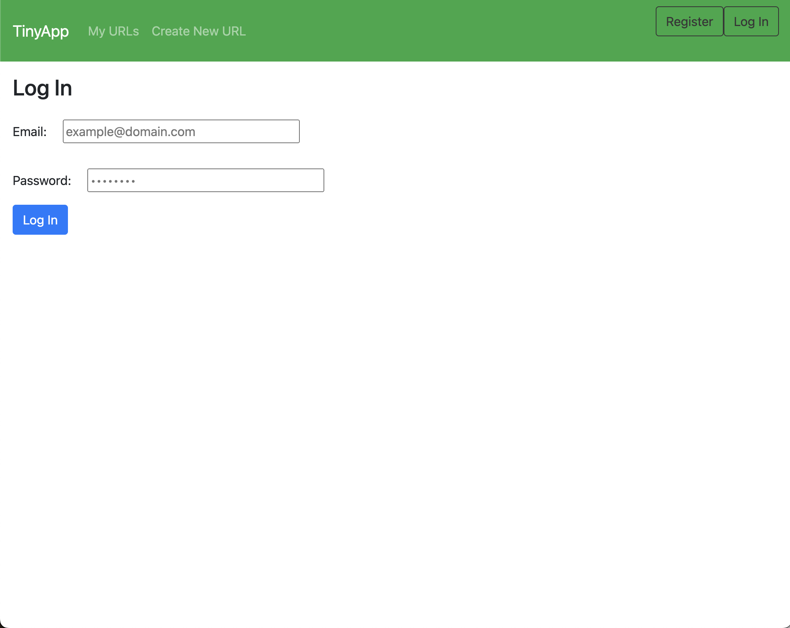
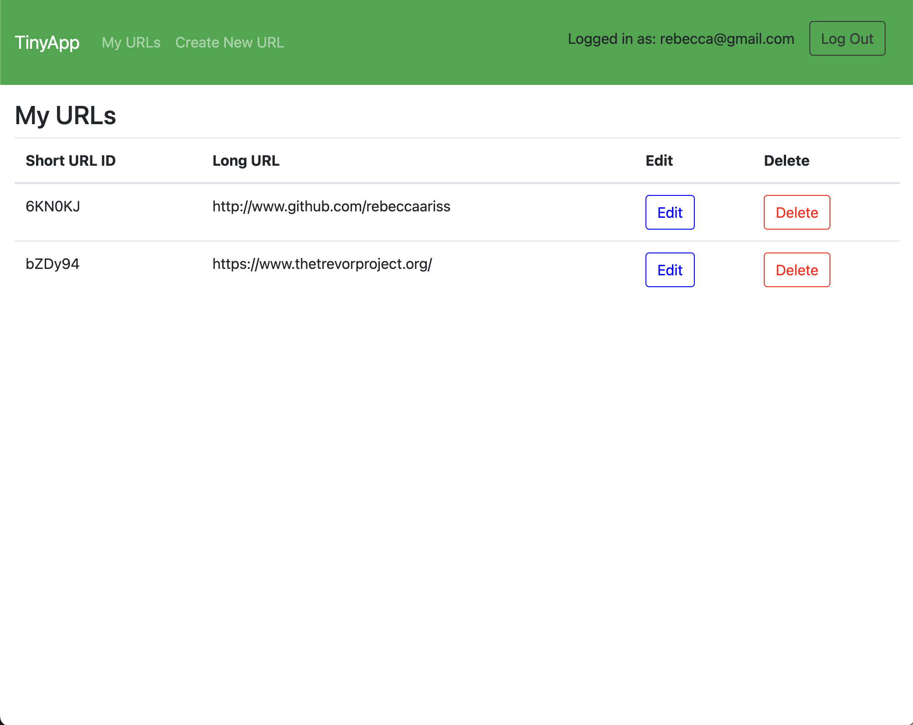
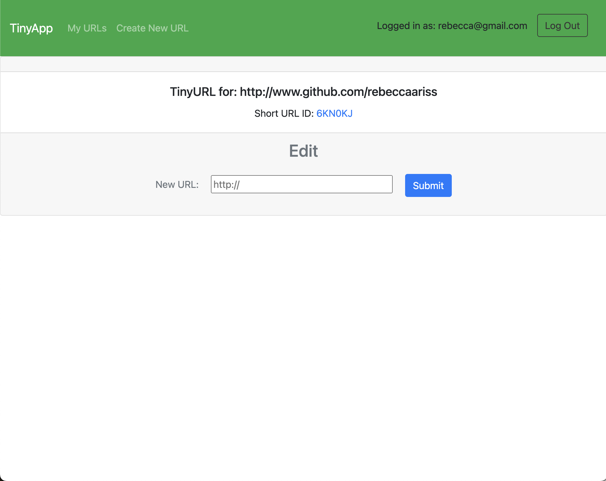
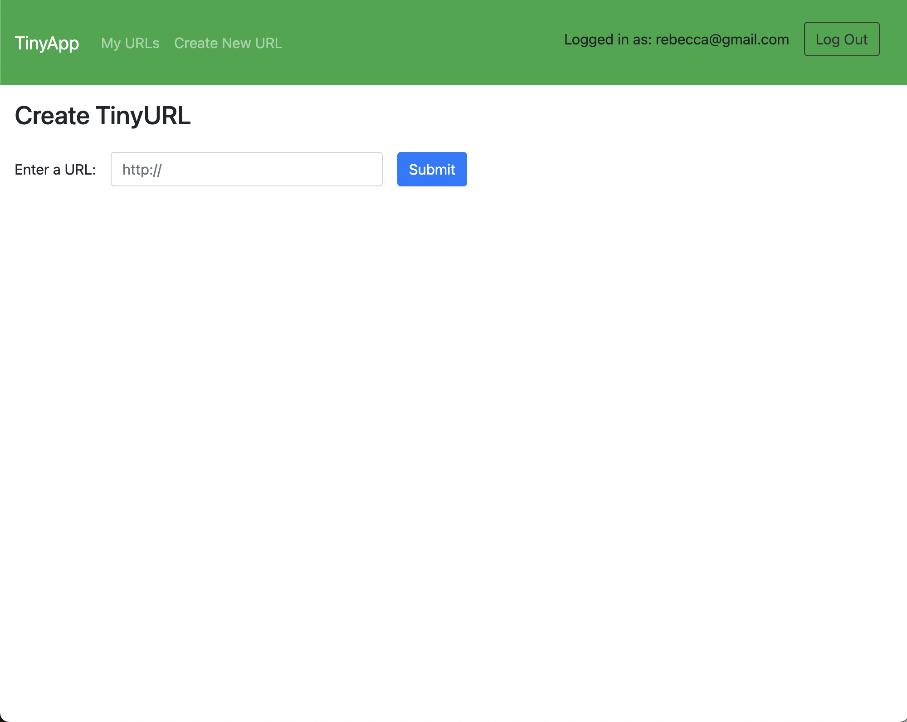

# TinyApp Project

TinyApp is a full stack web application built with Node and Express that allows users to shorten long URLs (à la bit.ly).

Similar to applications like Bit.ly and TinyURL, TinyApp is a project submitted for the Lighthouse Labs Web Development Bootcamp. Users can use this application to store a collection of URLs that have been condensed down into short URLS (alphanumeric strings consisting of six random characters). This makes it easier to share URLs on platforms such as Instagram or Twitter where a collection of URLs or a limited number of characters makes URL sharing more efficient and structured. (These are particularly useful in cases where character limits are in place).

## Final Product

## Dependencies

- Node.js
- Express
- EJS
- bcryptjs
- cookie-session

## Getting Started

- Install all dependencies (using the `npm install` command).
- Run the development web server using the `node express_server.js` command.
- You'll need to register as a new user before you can use the app as intended.